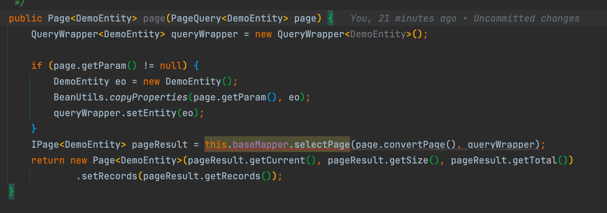

# AsyncExport
**2.0版本更新：** 

1. 增加了分页查询数据接口，导出查询指定方法时，会自动执行分页查询，防止一次性查询大量数据导致数据接口卡死
2. 增加了数据量超过5w时会进行自动sheet分页
3. 增加了可以根据数据库表名，自动生成配置好的导出实体类到指定目录下
### 参数介绍：
1. name:文件名称(必填)
2. methodPath:获取数据的方法路径(必填)
3. outMethodPath:二进制文件输出路径(异步模式需要)
4. syncFlag: 0:异步 或者 1:同步(默认异步模式)
### 简介：
该注解是基于反射加easyexcel实现的注解式导出功能，改注解分为两种模式:同步和异步导出  
同步模式开箱即用 一行注解解决导出

### 依赖配置
```
        <dependency>
            <groupId>com.asyncexport.boot</groupId>
            <artifactId>asyncexport</artifactId>
            <version>1.0.0</version>
        </dependency>
```
***
### 流程图：

***
#### 开箱配置
1. redis（用于异步模式的lock锁,同步无需）
2. 数据库（建表语句放在最下面，如果使用同步模式，则无需建表）
3. 定时器 例如：xxxjob等等（同步无需）
4. yml中可配置本地模式喝自定义模式 local:本地模式 输出至resources目录下，custom：自定义模式 需要填充outMethodPath参数，在执行完数据填充至文件后 会将文件以byte[]二进制数据传输至填充的outMethodPath路径（同步无需）
```
#配置异步模式 本地模式（local）或者自定义模式(custom)
ae:
  saveType: local
```

***
### 同步导出：
属于开箱即用无需配置，使用方法如下  
配置一个@ExcelProperty（表头名称） 修饰的实体
```
@Data
@HeadFontStyle(bold = BooleanEnum.FALSE,fontHeightInPoints = 10)
public class DemoEntity {
    @ExcelProperty("姓名")
    private String name;

    @ExcelProperty("年龄")
    private String age;
 }
```
一个自动生成的 或者 自己系统里的分页接口（如参类型一定要是PageQuery 项目中存在改实体，返回类型可以是Page（mybatisPlus的）类型也可以是list类型）


#### 使用方法：
直接使用注解,方法内无需写任何代码
```
    @PostMapping("/export")
    @AsyncExportTask(name = "测试导出", methodPath = "demoEntityService.page",syncFlag = 1)
    public void export(@RequestBody PageQuery<DemoEntity> page,HttpServletResponse response) {
    }
```
***
### 异步方式
异步方式的流转需要配合数据库使用 用来记录任务，使用方式和同步无太多差异，看需求配置  
1：异步方式需要用到数据库表作为任务记录的存储  
2：redis的作用是用来加数据锁，防止同条任务多次导出  
3：任务调用方式 推荐使用xxljob方式进行任务调度  
使用方式同上 sync_flag参数默认即可  
自定义模式需要填充 outMethodPath参数(文件输出路径)，二进制数据输出到此方法，可以选择上传至oss或者其他操作
***
## 数据库表设计
```
CREATE TABLE `bz_async_export_log` (
  `id` bigint unsigned NOT NULL AUTO_INCREMENT COMMENT 'ID',
  `warehouse_number` varchar(40) NOT NULL DEFAULT '' COMMENT '仓库号',
  `name` varchar(40) NOT NULL DEFAULT '' COMMENT '文件名称',
  `operation_code` varchar(40) NOT NULL DEFAULT '' COMMENT '下载文件码',
  `method_path` varchar(200) NOT NULL DEFAULT '' COMMENT '方法路径：类名.方法名',
  `params` text COMMENT '参数集合',
  `export_count` int NOT NULL DEFAULT '0' COMMENT '导出次数 超过3次则不再操作',
  `state` int NOT NULL DEFAULT '0' COMMENT '0：导出中;1: 导出成功;2:导出失败;',
  `is_delete` tinyint NOT NULL DEFAULT '0' COMMENT '删除标记',
  `out_method_path` varchar(40) NOT NULL DEFAULT '' COMMENT '异步二进制输出路径',
  PRIMARY KEY (`id`)
) ENGINE=InnoDB AUTO_INCREMENT=94 DEFAULT CHARSET=utf8mb4 COLLATE=utf8mb4_0900_ai_ci COMMENT='异步导出表'
```


