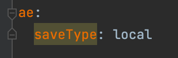
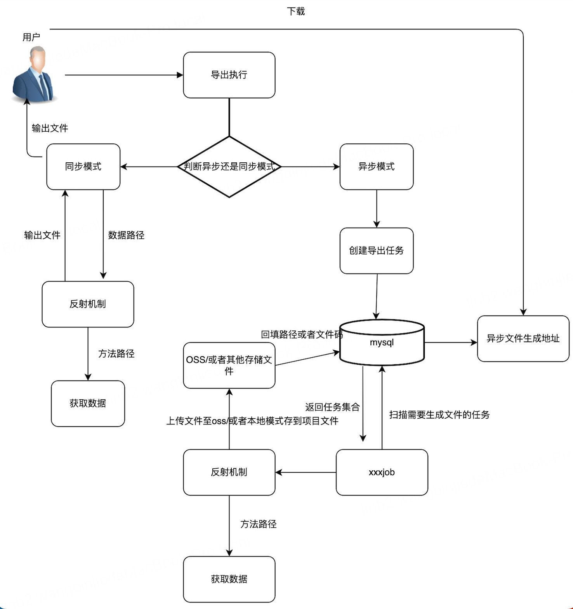
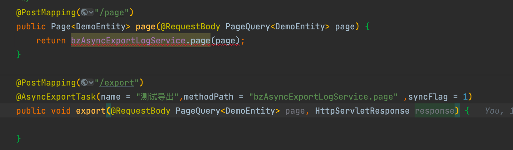

# AsyncExport
自定义异步同步导出注解  
### 参数介绍：  
1.name:文件名称(必填)  
2.methodPath:获取数据的方法路径(必填)  
3.outMethodPath:二进制文件输出路径(异步模式需要)  
4.syncFlag: 0:异步 或者 1:同步(默认异步模式)  
### 简介：  
该注解是基于反射加easyexcel实现的注解式导出功能，改注解分为两种模式:同步和异步导出  
### 流程图：

#### 开箱配置
1：redis（用于异步模式的lock锁,同步无需）  
2：数据库（建表语句放在最下面，如果使用同步模式，则无需建表）  
3：定时器 例如：xxxjob等等（同步无需）  
4：yml中可配置本地模式喝自定义模式 local:本地模式 输出至resources目录下，custom：自定义模式 需要填充outMethodPath参数，在执行完数据填充至文件后 会将文件以byte[]二进制数据传输至填充的outMethodPath路径（同步无需）  

### 同步导出：
属于开箱即用无需配置，使用方法如下  
配置一个@ExcelProperty（表头名称） 修饰的实体

一个自动生成的 或者 自己系统里的分页接口（如参类型一定要是PageQuery 项目中存在改实体，返回类型可以是Page（mybatisPlus的）类型也可以是list类型）

之后直接使用注解,方法内无需写任何代码

